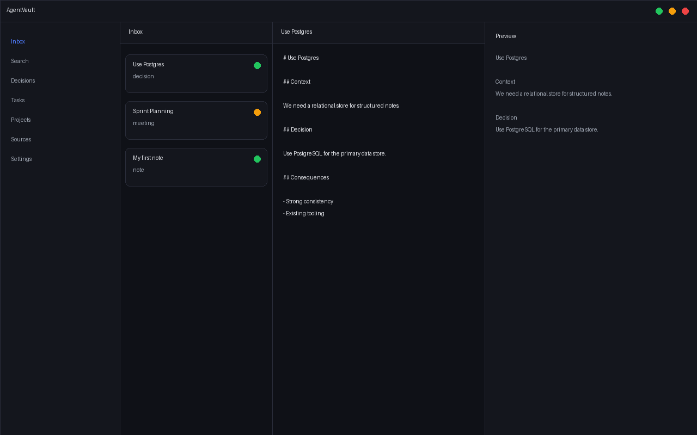

# AgentVault

[](https://github.com/dporkka/agentvault/actions/workflows/ci.yml)
[](https://github.com/dporkka/agentvault/releases)
[](https://go.dev)
[](LICENSE)

<p align="center">
  
</p>

**A local-first knowledge operating system for notes, decisions, research, tasks, and agent-readable context.**

AgentVault keeps your knowledge in plain Markdown with YAML frontmatter. The same files are readable by you, editable in any editor, and indexable by the Go core for fast full-text, semantic, and hybrid search. A single shared API contract keeps the CLI, local HTTP API, MCP server, desktop app, web app, browser extension, and mobile app in sync.

- **Files first.** Markdown is the durable source of truth; the SQLite index can be rebuilt at any time.
- **Local by default.** The CLI, HTTP API, and desktop app run on your machine.
- **Agent-ready.** Source-grounded answers, MCP tools, and structured note types make the vault usable by AI assistants.
- **One shared contract.** Go and TypeScript clients share a single API contract so server and clients stay in sync. See [`packages/contract/`](packages/contract/) and [`core/internal/contract/`](core/internal/contract/).

## Table of Contents

- [Features](#features)
- [Screenshot](#screenshot)
- [Quick Start](#quick-start)
- [Install](#install)
- [CLI Reference](#cli-reference)
- [Local HTTP API](#local-http-api)
- [MCP Server](#mcp-server)
- [Clients](#clients)
- [Architecture](#architecture)
- [Project Structure](#project-structure)
- [Development](#development)
- [Documentation](#documentation)
- [License](#license)

## Features

| Feature | What it does |
| --- | --- |
| **Markdown-native vault** | Notes are plain Markdown files with YAML frontmatter. No lock-in, full version-control friendliness. |
| **Full-text, vector, and hybrid search** | SQLite FTS5 plus optional embedding-based semantic search, exposed through one search interface. |
| **Structured note types** | `note`, `decision`, `task`, `meeting`, `source`, and `project` templates with consistent folder rules. |
| **Source-grounded AI** | `agentvault ask` and `POST /ask` retrieve relevant notes first, then answer with citations. |
| **Local HTTP API** | A loopback REST API for desktop, web, extension, and mobile clients. |
| **MCP server** | Expose vault search, read, create, capture, and ask as Model Context Protocol tools. |
| **Multi-client support** | First-party desktop (Wails), web (Vite), browser extension (MV3), and mobile (Expo) apps. |
| **Vault diagnostics** | `agentvault doctor` checks config, database, migrations, links, orphan chunks, embeddings, and API auth. |

## Screenshot

<p align="center">
  
</p>

The desktop app shows the inbox, a Markdown editor with live preview, and sync-state indicators for each note.

## Quick Start

Install the CLI from a [release binary](docs/INSTALL.md#cli) or [build from source](docs/INSTALL.md#building-from-source), then:

```bash
# Initialize a vault
agentvault init ./my-vault
cd ./my-vault

# Create structured notes
agentvault new note --title "My first note"
agentvault new decision --project platform --title "Use Postgres"
agentvault new task --project platform --title "Build API"

# Index and search
agentvault index
agentvault search "Postgres"

# Ask a source-grounded question
agentvault ask "What have I decided about vector search?"

# Validate vault health
agentvault doctor
```

## Install

AgentVault publishes release artifacts on every `v*.*.*` tag:

- CLI archives for Linux, macOS, and Windows
- Desktop apps for Linux, macOS (`.dmg`), and Windows (installer `.exe`)
- Browser extension zip
- Mobile iOS/Android export bundles

See [`docs/INSTALL.md`](docs/INSTALL.md) for per-platform installation instructions.  
For signed installers and store publishing setup, see [`docs/PUBLISHING.md`](docs/PUBLISHING.md).

## CLI Reference

| Command | Description |
| --- | --- |
| `agentvault init [path] [--template]` | Initialize a vault and optionally apply a starter template |
| `agentvault index [--force] [--rebuild] [--embed]` | Index Markdown files and optionally generate embeddings |
| `agentvault search <query> [--type] [--project] [--tag] [--status] [--vector] [--hybrid-weight] [--topk]` | Full-text or hybrid search with filters |
| `agentvault read <id-or-path>` | Read a note by ID or path |
| `agentvault new <type> --title <title>` | Create a structured note from a template |
| `agentvault ask <question>` | Ask a source-grounded question over indexed notes |
| `agentvault import <type> <source>` | Import Markdown or Obsidian notes (`type`: `markdown` or `obsidian`) |
| `agentvault doctor` | Validate vault health |
| `agentvault config get/set/show` | Manage vault configuration |
| `agentvault git status/diff/commit/log/init` | Run Git commands from the vault context |
| `agentvault serve` | Start the local HTTP API |
| `agentvault mcp serve` | Start the MCP server |

### Note Types

```bash
agentvault new note --title "My Idea"
agentvault new decision --project platform --title "Use Postgres"
agentvault new task --project platform --title "Build API"
agentvault new meeting --project platform --title "Sprint Planning"
agentvault new source --title "Article" --url "https://example.com"
agentvault new project --title "Platform"
```

## AI Configuration

By default, AgentVault uses Ollama at `http://localhost:11434`.

```json
{
  "ai": {
    "provider": "ollama",
    "baseUrl": "http://localhost:11434",
    "chatModel": "llama3.1",
    "embeddingModel": "nomic-embed-text"
  }
}
```

Supported providers: `ollama`, `openai`, `anthropic`, `openrouter`, and `mock`.  
Cloud providers read `AGENTVAULT_API_KEY` when no key is stored in the vault config.

```bash
agentvault ask "What have I decided about vector search?"
agentvault ask --provider openai --model gpt-4o-mini "Summarize open architecture decisions"
agentvault index --embed
```

## Local HTTP API

```bash
# Default bind address: 127.0.0.1:47321
agentvault serve
agentvault serve --port 8080
```

The server prints an auth token at startup. `GET` endpoints are open locally; write endpoints require the token in either the `X-AgentVault-Token` header or `Authorization: Bearer <token>`.

| Endpoint | Description |
| --- | --- |
| `GET /health` | Server health |
| `GET /auth/verify` | Verify a stored auth token |
| `GET /vault/status` | Vault status and indexed note count |
| `POST /vault/index` | Trigger indexing |
| `GET /search?q=...` | Search notes |
| `GET /notes/{id}` | Read a note |
| `POST /notes` | Create a note |
| `POST /capture` | Capture to inbox |
| `POST /ask` | Ask a source-grounded question |
| `GET /projects` | List projects (JSON `string[]`) |
| `GET /recent` | Recent notes |
| `GET /stale` | Stale notes |
| `GET /git/status` | Vault Git status |

For the full contract, including exact request/response shapes, auth rules, CORS policy, and rate limits, see [`docs/API_CONTRACT.md`](docs/API_CONTRACT.md).

## MCP Server

```bash
# stdio mode for Claude, Cursor, and other MCP clients
agentvault mcp serve

# HTTP mode
agentvault mcp serve --http --port 7777
```

Registered tools:

- `agentvault.search`
- `agentvault.read_note`
- `agentvault.create_note`
- `agentvault.create_decision`
- `agentvault.create_task`
- `agentvault.capture`
- `agentvault.summarize`
- `agentvault.list_projects`
- `agentvault.list_recent`
- `agentvault.git_status`
- `agentvault.log_agent_run`
- `agentvault.ask`

## Clients

AgentVault ships with several first-party clients, all built against the shared `@agentvault/contract` package.

| Client | Location | Notes |
| --- | --- | --- |
| **Desktop** | [`apps/desktop-wails/`](apps/desktop-wails/) | Wails v2 app with a React/TypeScript frontend. Vault picker, search, editor, dashboards, settings, and AI panel. |
| **Web** | [`apps/web-local/`](apps/web-local/) | React/Vite client for the local HTTP API. |
| **Browser extension** | [`apps/browser-extension/`](apps/browser-extension/) | Manifest V3 extension for page capture and vault search through the local API. |
| **Mobile** | [`apps/mobile-expo/`](apps/mobile-expo/) | Expo app with capture-first flows, local inbox, settings, search, and sync hooks. |

## Architecture

```text
Markdown/YAML files
        |
        v
Go core engine
        |
        +--> SQLite + FTS5 + chunks
        +--> CLI
        +--> Local HTTP API
        +--> MCP server
        +--> Wails services
                 |
                 v
        Desktop, web, browser extension, mobile, and agent clients
```

## Project Structure

```text
agentvault/
├── core/                         # Go core engine and CLI
│   ├── cmd/agentvault/           # Cobra commands
│   ├── internal/
│   │   ├── ai/                   # AI provider interface and providers
│   │   ├── api/                  # Local HTTP API
│   │   ├── chunker/              # Markdown/text chunking
│   │   ├── config/               # Vault configuration
│   │   ├── contract/             # Shared Go API contract types
│   │   ├── db/                   # SQLite wrapper and migrations
│   │   ├── doctor/               # Vault validation
│   │   ├── embeddings/           # Embedding clients
│   │   ├── git/                  # Git CLI wrapper
│   │   ├── importers/            # Markdown and Obsidian importers
│   │   ├── indexer/              # File scanner and index writer
│   │   ├── markdown/             # Frontmatter/parser utilities
│   │   ├── mcp/                  # MCP server and tools
│   │   ├── rag/                  # Retrieval-augmented generation pipeline
│   │   ├── search/               # FTS and vector search
│   │   ├── templates/            # Note and starter templates
│   │   ├── vault/                # Vault folder layout
│   │   └── vectors/              # Vector math
│   └── migrations/001_init.sql
├── apps/
│   ├── desktop-wails/            # Wails v2 desktop app
│   ├── web-local/                # React/Vite local web app
│   ├── browser-extension/        # MV3 browser extension
│   └── mobile-expo/              # Expo mobile app
├── packages/
│   └── contract/                 # Shared TypeScript API contract
├── docs/
│   ├── API_CONTRACT.md
│   ├── CODEBASE_ANALYSIS.md
│   ├── COMPATIBILITY.md
│   ├── IMPROVEMENT_PLAN.md
│   ├── INSTALL.md
│   ├── PUBLISHING.md
│   └── SECURITY.md
├── Makefile
└── README.md
```

## Development

The repository is a monorepo. The Makefile provides the common tasks.

```bash
# Build the CLI
make build

# Run Go tests
make test

# Run Go linting (vet + fmt)
make lint

# Verify the shared API contract across all clients
make contract-check

# Build all release artifacts
make release

# Check whether publishing secrets are configured
make check-secrets
```

### Frontend clients

```bash
# Web app
cd apps/web-local && npm ci && npm run build

# Browser extension
cd apps/browser-extension && npm ci && npm run build

# Desktop frontend
cd apps/desktop-wails/frontend && npm ci && npm run build

# Mobile type-check
cd apps/mobile-expo && npm ci && npm run typecheck
```

### Desktop app

The Wails desktop app requires GTK and WebKit2GTK 4.1 development libraries. On Ubuntu 24.04+ and 26.04, build with the `webkit2_41` tag:

```bash
make desktop
```

For live development:

```bash
make desktop-dev
```

## Documentation

- [`docs/INSTALL.md`](docs/INSTALL.md) — Install the CLI, desktop, web, extension, and mobile apps.
- [`docs/API_CONTRACT.md`](docs/API_CONTRACT.md) — Full local HTTP API contract.
- [`docs/SECURITY.md`](docs/SECURITY.md) — Security boundaries and threat model.
- [`docs/COMPATIBILITY.md`](docs/COMPATIBILITY.md) — Platform and dependency matrix.
- [`docs/PUBLISHING.md`](docs/PUBLISHING.md) — Signed installers and store publishing setup.
- [`docs/IMPROVEMENT_PLAN.md`](docs/IMPROVEMENT_PLAN.md) — Roadmap and completed milestones.
- [`docs/CODEBASE_ANALYSIS.md`](docs/CODEBASE_ANALYSIS.md) — High-level codebase notes.

CI runs `make ci`, frontend builds, mobile type-checks, and the desktop Go build with the `webkit2_41` tag. Packaged CLI artifacts can be smoke-tested with `make smoke-test`.

## License

Apache 2.0. See [LICENSE](LICENSE).
